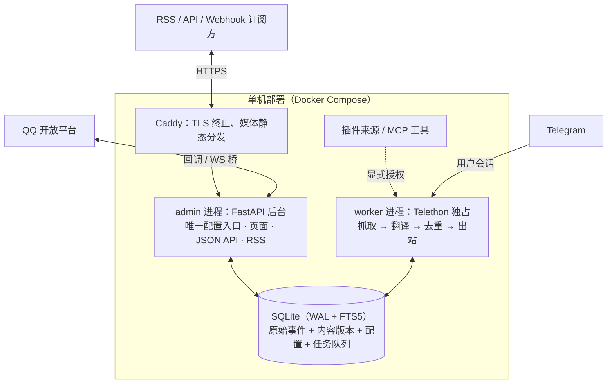

# tgmon

[](https://github.com/znjhahaha/tgmon/actions/workflows/docker.yml)
[](LICENSE)
[](https://github.com/znjhahaha/tgmon/pkgs/container/tgmon)

tgmon 是一个通用资讯采集、翻译、归档与分发平台：Telegram 或插件来源 → 内容版本化 → 翻译与检索 → RSS、HTTP API、Webhook、QQ 推送和分享页。游戏主题是内置预设，也可以切换为科技、新闻等通用主题。

系统面向单机、低带宽跨境链路场景设计：计算密集型工作在海外 VPS 上完成，对外提供统一的文本、媒体和分享投影。内置游戏主题默认覆盖原神、崩坏：星穹铁道、绝区零，但业务链路不依赖某个游戏。

## 功能特性

**监控与翻译**

- 基于用户账号（Telethon）监控任意已加入频道，含私密频道；后台可从账号一键同步频道列表，无需手动收集频道 ID 或邀请链接
- 游戏主题按证据归类，通用主题不强行套用游戏知识；网站、RSS、API、分享与 QQ 共用同一内容投影
- 翻译管线：缓存 → 预算闸门 → 术语注入 → 多后端故障转移 → 译后校验；相同原文请求合并，不重复翻译
- 图片与视频独立归档：保存来源身份、原文件校验和、预览及失败状态；视频下载支持断点续传、原子落盘和转码队列，空间不足进入等待状态，不静默丢弃

**知识库与检索**

- `/kb` 知识中心含五个页签：资料与术语、来源同步、检索与索引、对话记忆、诊断
- 首次启动自动登记原神、崩坏：星穹铁道、绝区零三个 Fandom MediaWiki API 来源，按角色 / NPC / 派系 / 设定分类同步
- Wiki 新页面与 revision 变更默认进入待审核队列，审核通过后才进入翻译术语表；无有效中文名的候选被驳回并保留，可随时复查
- 本地向量检索：内置 `BAAI/bge-small-zh-v1.5`（512 维，CPU 推理，无需外部 API 与密钥），与 SQLite FTS5 全文索引混合排序；模型缺失时自动回退关键词检索
- 本地修正过的中文名在后续 Wiki 同步中保留，不会被源数据覆盖

**QQ 机器人**

- 两种事件入口：QQ 开放平台 Webhook 回调，或独立 botpy 客户端走 WebSocket 桥
- 群内命令、AI 意图路由与多轮对话记忆（见下文命令表），上下文按机器人、群、成员和私聊隔离
- 现有推送按主题聚合：60 秒窗口内合批发送（每批最多 5 条），失败按退避重试，送达状态持久化；不增加语音、日报、提醒或主动闲聊
- 同条爆料的多张图片按原顺序合并为一张 JPEG 长图直传 QQ：等比缩放、不裁切，上限 16000 像素高，正文随媒体消息发出；直传失败回退 URL 中转
- 支持多个 QQ 机器人，每个机器人独立凭据、能力状态、群归属和推送熔断

**输出与分享**

- RSS（可切纯文本版）、带 API Key 鉴权的 HTTP API、HMAC-SHA256 签名的 Webhook
- 分享卡片：筛选结果生成两遍布局长图，含完整正文与媒体、消息边界分页、JPEG / ZIP 下载、公开 token 访问

**运行时与运维**

- 双进程单机 Docker Compose 部署，Caddy 终止 TLS 并静态分发媒体；SQLite WAL 同时保存原始事件、内容版本和处理任务
- 除少量启动参数外，全部配置在 Web 后台修改、即时生效
- 发布脚本先在数据库副本上验证，再备份切换；换机 = `git clone` + 拷贝状态目录
- 主题、插件和 MCP 均显式配置；插件运行在独立宿主进程，外部 MCP 工具默认关闭
- 当前回归套件为 382 个通过、3 个跳过，包含媒体、相册、记忆、推送恢复、迁移和扩展接口回归

## 架构

### 双进程模型



```
admin   FastAPI Web 后台（唯一配置入口）。永不接触 Telethon
worker  独占用户会话，执行抓取管线并消费任务队列
```

拆分为两个进程的原因：Telethon 的会话是 SQLite 文件，两个进程同时使用同一会话会互锁并可能损坏授权状态。因此只有 worker 持有 Telegram 连接；admin 需要执行任何涉及 Telegram 的操作（发送验证码、登录、同步频道列表、测试 Provider）时，向 `task` 表写入一条任务，由 worker 执行后回填结果。网页端的 Telegram 登录流程正是通过该队列绕开了 Telethon 的 stdin 交互限制。

两个进程仅通过 SQLite 通信（配置、原始事件、内容版本和持久化任务表），WAL 模式并发读写。每个任务有唯一键、租约、重试次数和作用域顺序；进程重启后会恢复到期租约。采集入口先保存原始事件再交给 worker，补拉使用分页游标和缺口记录。

### 部署网络的实测约束

架构由部署环境的实测网络特性决定：

| 实测指标 | 设计决策 |
|---|---|
| 拉取国际数据 200 MB/s | 从 Telegram 抓取消息与媒体无瓶颈 |
| 回大陆单连接较慢 | QQ 发送使用预览、长图和可复用上传缓存；原始媒体留在归档目录，按状态和配额管理 |
| OpenAI / Anthropic 官方端点 403 | Provider 的 `base_url` 必填且无默认值，需使用中转端点或 Gemini |
| 磁盘余量小、无 swap | 媒体按 7 天 TTL、总量配额和磁盘水位清理；不足时任务等待并显示原因 |
| RTT 233 ms | 服务端渲染 + CSS 内联，无 SPA bundle |

## 快速开始

### 前置要求

- 一台海外 VPS：Docker + Docker Compose v2、git；磁盘需容纳约 1 GB 镜像（含 embedding 权重）及媒体库
- Telegram 账号的 `API_ID` / `API_HASH`（在 [my.telegram.org](https://my.telegram.org) 申请）
- 翻译后端：OpenAI / Anthropic 协议兼容端点（支持自定义 `base_url`）或 Gemini
- 可选：QQ 开放平台（[q.qq.com](https://q.qq.com)）机器人凭据

### 镜像部署（推荐）

镜像由 GitHub Actions 自动构建并发布到 `ghcr.io`，与仓库同为公开，拉取无需登录。每次 push 到 main 更新 `latest`，打 `v*` tag 另发版本号镜像，同时保留 `sha` 快照便于回滚。

```bash
git clone https://github.com/znjhahaha/tgmon.git /opt/tgmon
cd /opt/tgmon && ./deploy.sh
```

使用私有镜像仓库部署时，先 `export GH_PAT=<GitHub PAT，repo + read:packages 权限>` 再执行上述命令。

`deploy.sh` 自动生成 `.env` 与随机后台密码、拉取镜像、启动容器并做健康检查。生产 compose 不挂载源码，应用代码和 embedding 权重都来自镜像。此后更新版本只需：

```bash
./deploy.sh update    # 快进拉取代码与镜像，滚动重启
```

### 源码部署（开发调试）

```bash
git clone <仓库地址> /opt/tgmon && cd /opt/tgmon
cp .env.example .env
# 编辑 .env：至少填 TGMON_ADMIN_PASSWORD 和 TGMON_BASE_URL
docker compose up -d --build
```

源码模式将 `./tgmon` 只读挂载进容器：改代码后 `docker compose restart` 即生效，仅修改 `requirements.txt` 时需要重建。生产环境使用 `docker-compose.prod.yml`（纯镜像、不挂代码）。

### 发布与回滚

需要发布时，先在工作区完成测试，再推送 `main`。GitHub Actions 构建 `ghcr.io/znjhahaha/tgmon:latest`，生产机执行 `./deploy.sh update`。需要严格切换时使用两段式发布脚本：

```bash
release=20260909-general
./scripts/stage_release.sh "$release"   # 在数据库副本上迁移并检查
./scripts/apply_release.sh "$release"   # 停写、备份、切换、健康检查
```

`apply_release.sh` 会保存旧镜像、旧源码和数据库备份；新服务未通过健康检查会自动恢复。生产机上的 `.env`、`secret.key`、`sessions/`、`db/` 和 `media/` 不由 Git 管理。

### 首次配置

打开 `https://<你的地址>`，用 `admin` + 初始密码登录后台，依次完成：

1. **账号与凭据** —— 填入 `API_ID` / `API_HASH` / 手机号 → 点「发送验证码」→ 填入验证码（**验证码发到 Telegram 客户端，不是短信**）→ 如开启了两步验证再填密码
2. **频道管理** —— 点「从我的账号同步」，勾选要监控的频道，无需手动抄 ID；可点「补最近 20 条历史」立即验证管线，不必等新消息
3. **Provider** —— 添加一个部署机可访问的翻译后端，点「连通性测试」
4. **术语表** —— 按游戏维护术语；爆料翻译质量很大程度取决于这张表
5. **输出配置** —— 创建 RSS feed / 生成 API Key / 配置 Webhook

第 1–2 步完成后即可在「消息」页看到数据落库。

## 配置

### 环境变量

以下变量写在 `.env`：应用启动参数、Caddy 反向代理的站点配置与功能默认开关。其余全部配置在网页后台修改：

| 变量 | 必填 | 默认值 | 说明 |
|---|---|---|---|
| `TGMON_SECRET_KEY` | 否 | 自动生成 `secret.key` | 加密 DB 内敏感字段（`api_hash` / `api_key` / HMAC 密钥）的主密钥；换机时必须携带 |
| `TGMON_ADMIN_PASSWORD` | 首次部署 | — | 后台初始密码，建号后可在网页改密并清空此行 |
| `TGMON_BASE_URL` | 是 | — | 对外地址（域名或 IP），RSS 绝对链接与 Webhook 回调使用 |
| `TGMON_LOG_LEVEL` | 否 | `INFO` | 日志级别：`DEBUG` / `INFO` / `WARNING` |
| `TGMON_DOMAIN` | 有域名时 | `localhost` | 对外域名（Caddy 反代站点），与 `TGMON_BASE_URL` 的主机名保持一致 |
| `TGMON_IP` | 否 | `127.0.0.1` | IP 直连回退入口（自签证书），仅需要绕过 DNS 时设置 |
| `TGMON_RETRIEVAL_ENABLED` | 否 | `true` | 消息混合检索开关 |
| `TGMON_EMBEDDING_ENABLED` | 否 | `true` | 本地 embedding 开关 |
| `TGMON_MEMORY_ENABLED` | 否 | `true` | QQ 对话记忆开关 |
| `TGMON_MEMORY_TTL_DAYS` | 否 | `30` | 短期对话记忆保留天数 |
| `TGMON_PLUGIN_ENABLED` | 否 | `true` | 是否允许本地插件宿主 |
| `TGMON_MCP_ENABLED` | 否 | `false` | 是否启用外部 MCP 工具，默认关闭 |
| `TGMON_WIKI_SYNC_ENABLED` | 否 | `true` | Wiki 知识库同步开关 |
| `TGMON_WIKI_FETCH_INTERVAL_HOURS` | 否 | `24` | Wiki 同步间隔（小时） |

### 优先级与热生效

读取优先级为 **DB → `.env` → 内置默认**；首次启动把 `.env` 作为种子导入数据库。

修改后需要重新登录 Telegram 的只有 `API_ID` / `API_HASH` / `PHONE_NUMBER`（相当于更换应用或账号）。其余配置全部热生效：prompt、术语表、去重阈值、限流、保留策略、频道开关、Provider、主题和插件配置。MCP 只有显式授权给机器人和工具后才会连接。

## 输出接口

| 方法 | 路径 | 说明 |
|---|---|---|
| GET | `/rss/{slug}` | RSS 订阅；`?media=none` 为纯文本版 |
| GET | `/feeds` | 全部 feed 地址清单 |
| GET | `/api/messages` | 分页消息，支持按频道 / 时间 / 关键词 / 重复状态过滤 |
| GET | `/api/messages/{id}` | 单条消息详情 |
| GET | `/api/messages/{id}/related` | 相关消息 |
| GET | `/api/search` | 关键词检索 |
| GET | `/api/channels` | 频道列表与统计 |
| GET | `/api/stats` | 总量与 worker 状态 |
| POST | `/api/webhook/test` | 手动触发一次 Webhook 推送 |

- HTTP API 鉴权：`X-API-Key` 请求头，带速率限制
- Webhook 载荷签名：`X-Tgmon-Signature: sha256=<hex>`（HMAC-SHA256），投递失败按退避重试
- 私有 feed 同样要求 `X-API-Key`

## QQ 机器人

### 接入

1. 在 [q.qq.com](https://q.qq.com) 创建机器人，取得 `AppID` / `AppSecret`
2. 后台「QQ 机器人」页添加一个或多个机器人，分别保存 `AppID` / `AppSecret`；按群选择归属机器人并打开现有推送
3. 事件入口二选一：
   - **Webhook 回调** —— 平台直接回调 `/qqbot/callback`
   - **botpy WebSocket 桥** —— 每个机器人运行一个独立 botpy 客户端，连接 `/qqbot/bridge`，凭 `QQ_BRIDGE_TOKEN` 鉴权，适合回调地址不可达的部署

机器人能力由 QQ API 实际反馈决定。主动推送遇到无权限错误会停止该机器人无效重试并保留未读内容；被动回复仍按原请求有效期处理。系统不自动发送日报、提醒、语音或闲聊消息。

### 命令表

| 命令 | 说明 |
|---|---|
| `/help` | 命令列表 |
| `/latest [n]` | 最新 n 条爆料（默认 3，最大 5，按发布时间排序，带图） |
| `/new` | 本群未读增量（上次拉取之后的新消息） |
| `/search 关键词` | 模糊搜索，返回最近 3 条命中 |
| `/ask 问题` | 基于已收录消息回答，附 `【消息#id】` 证据引用 |
| `/translate [游戏] 文本` | 按已审核术语翻译；也可 `/translate #消息id` 翻译已收录消息 |
| `/tr 文本` | `/translate` 别名 |
| `/related 消息id` | 相关消息 |
| `/timeline 关键词` | 消息时间线 |
| `/game 名称 [n]` | 按游戏过滤最新 |
| `/peek 消息id` | 单条完整内容与全部图片 |
| `/video 消息id` | 发送该消息的归档视频 |
| `/stats` | 今日统计（消息数 / 游戏分布 / 频道数） |
| `/status` | 运行状态（桥在线 / 群数 / 今日推送） |
| `/on` / `/off` | 本群推送开关 |
| `/ai 问题` | 显式 AI 问答 |
| `/remember 事实` / `/forget 关键词` | 写入 / 删除个人记忆 |
| `/nickname 昵称` | 设置机器人的称呼（或直接说「叫我 XX」） |
| 非命令文本 | AI 意图路由（默认开启，可在后台关闭） |

### 推送与限流

- **批次**：现有推送按主题聚合，60 秒窗口（`QQ_BATCH_WINDOW_SECONDS`）内同一主题的消息合为一批，每批最多 5 条；`/latest`、`/new`、`/game`、`/peek` 与推送均保留同条爆料的全部图片
- **长图**：群富媒体接口一次只接受一个文件，图组按原顺序合并为一张 JPEG 长图（等比缩放、不裁切，上限 16000 像素高），正文附在同一条媒体消息上
- **上传**：优先通过 QQ `file_data` 直传；失败才回退到已配置的 URL 中转（GitHub 图床 / 本站）
- **重试**：发送失败按退避策略重试，送达状态持久化；传输结果不明会进入待核实状态，不会盲目重发造成重复
- **被动回复**：每条 @ 消息最多回复 5 次（平台限制），超限自动截断并提示

### 对话记忆

- 作用域隔离：机器人、群话题、群内成员、私聊各自独立；群公开话题共享，个人资料只对本人可见
- 模型接收带角色、说话人、引用和发送状态的多轮消息；近期历史按 token 预算保留，旧历史生成可追溯摘要
- 记忆默认保留 30 天（`MEMORY_TTL_DAYS`）；成员可用 `/remember` 主动写入事实、`/forget` 删除或修订，原句和来源事件保留

## 主题、插件与 MCP

主题包把分类别名、术语和翻译提示词从业务代码中分离。内置 `gaming` 和 `generic`，后台可安装本地 JSON 主题；旧的 `game` 参数仍映射到游戏主题。

插件通过 `plugin.json` 声明命令、工具、来源和事件能力，运行在独立 Python 宿主进程。宿主使用逐行 JSON 协议，调用有大小和超时限制；插件崩溃只记录错误，不阻塞 Telegram 采集、翻译或 QQ 推送。安装、启停、配置和错误状态可在后台「主题与扩展」查看。

MCP 使用官方 Python SDK，支持 stdio 和 Streamable HTTP。服务、工具和机器人授权都必须显式配置，默认关闭；发现结果有短期缓存，调用前再次检查授权和 JSON Schema。协议细节和示例见 [`docs/extensions.md`](docs/extensions.md)。

## 知识库与检索

### Wiki 同步与审核

- 首次启动登记原神、崩坏：星穹铁道、绝区零三个 Fandom MediaWiki API 来源；通用 MediaWiki 适配器也支持接入其他源
- 同步按角色 / NPC / 派系 / 设定分类，默认每 24 小时一次；revision 变更幂等处理，源页面消失时保留旧数据、连续多次消失才禁用该来源
- 审核流：新页面与变更默认待审，后台 `/kb` 支持按游戏 / 分类 / 状态筛选、勾选批量审核、直接修订中文名；审核通过后进入翻译术语表
- 质量规则：中文名只从 Wiki 语言字段与 infobox 解析，绝不用英文标题充当中文名；无有效中文名的候选驳回并保留；驳回决定在后续同步中保持，仅当出现新的有效译名候选才重新打开审核

### 术语校正

翻译时按检测到的游戏取对应术语作用域，最长匹配优先替换；保护 URL、代码、数字、歧义词与已正确的名称不被误替换；无法解析的词项会汇总报告漏译。

### 混合检索

- 消息入库即写入 SQLite FTS5 索引；本地 embedding（`BAAI/bge-small-zh-v1.5`，512 维，CPU，经 fastembed 运行）与全文检索混合排序
- Docker 构建时下载约 90 MB 权重并打包进镜像，运行时不访问外部 embedding API；非 Docker 安装先执行 `python -m tgmon.embeddings --download`
- 长文分块计算向量；内容修改或模型升级自动重建索引，旧模型向量不会混用
- 检索支持游戏 / 频道 / 时间 / 实体过滤；QQ 侧的 `/search`、`/ask`、`/related`、`/timeline` 与网页后台共用同一检索接口
- 模型不可用时自动回退关键词检索，功能不中断

## 消息去重

| 层级 | 机制 | 说明 |
|---|---|---|
| 1. 事件身份 | `(channel_id, tg_message_id, revision)` 与持久化来源事件唯一键 | 防重复回放，并保留编辑版本 |
| 2. 文件集合 | 同一消息的附件身份、精确 SHA-256 和完整图组指纹 | 新增图片或视频不会被旧附件误判覆盖 |
| 3. 近似关联 | 文本 SimHash、图片 pHash / dHash 只生成关联候选 | 近似内容保留，不凭单张图片隐藏整条资讯 |

第 3 层实测边界（后台「去重」页内置对照表）：重新编码、强压缩、半透明水印、不透明色块水印、调亮均可命中（距离 0–2）；**裁剪与加边框无法命中**（距离 11–29），这是感知哈希的固有限制，由第 2 层兜底。

精确重复自动合并；近似候选保留为 `ContentRelation`，不删除正文或媒体。后台可展开查看相关内容并人工确认。网站、RSS、API、分享与 QQ 都从同一内容版本投影生成。

## 分享卡片

- 在「分享」页按条件筛选消息（最多 50 条），生成两遍布局的长图卡片：完整正文与媒体、按消息边界分页
- 支持 JPEG 与 ZIP 打包下载、跨分页多选、完整文案复制
- 每个分享生成公开 token，读者无需登录即可通过链接查看长图与媒体

## 运维

### 更新

```bash
./deploy.sh update
```

拉取最新代码与镜像并滚动重启。

### 发布流程

生产发布使用两段式脚本：

1. `scripts/stage_release.sh` —— 先在数据库副本上运行新版本验证
2. `scripts/apply_release.sh` —— 自动备份数据库后切换服务

发布前还可以直接运行 `python scripts/validate_migration.py <source.sqlite3> <destination.sqlite3>`，它只在副本上建表、迁移并验证幂等，不会写入源库。`python scripts/container_smoke.py` 用于无网络容器内的依赖、路由和 FFmpeg 检查。

### 备份与迁移

代码在 git 里，换机时 `git clone` + 启动即可恢复服务；以下数据**不在 git 里**，需单独迁移：

| 内容 | 丢失后果 |
|---|---|
| `.env` + `secret.key` | DB 内已存的 `api_hash` / `api_key` 解不开，需重新配置并重新登录 |
| `sessions/` | Telegram 登录态丢失，需重新验证码登录 |
| `db/` | 全部消息、配置与知识库数据 |
| `media/` | 缩略图与归档媒体 |

后台「系统」页可下载配置备份（配置 + 术语表 + prompt + feed 定义）；`scripts/backup.sh` 与 `scripts/backup_database.py` 用于数据库备份。

### 健康检查

`GET /healthz` 返回服务存活状态，`deploy.sh` 的启动检查依赖它。

### 账号风险

使用用户账号自动化读取违反 Telegram 服务条款，加入大量爆料频道更容易触发风控。**强烈建议使用专用小号，不要用主账号**；`sessions/` 要备份；控制加入频道的节奏。这是本方案最大的不可逆风险。

## 开发

### 本地环境

```bash
cp .env.example .env       # 填 TGMON_ADMIN_PASSWORD / TGMON_BASE_URL
docker compose up -d --build
```

源码模式将 `./tgmon` 只读挂载进容器：改代码后 `docker compose restart` 生效，改 `requirements.txt` 后需 `--build` 重建。

### 测试与检查

```bash
python -m pytest -q --tb=short --disable-warnings
python -m compileall -q tgmon scripts
```

回归覆盖真实上下文、记忆修订与遗忘、编辑版本、相册跨页、媒体断点续传、精确和近似去重、QQ 发送恢复、迁移、主题、插件和 MCP。当前基线为 383 个通过、3 个跳过。

### 技术栈

| 层 | 选型 |
|---|---|
| 抓取 | Telethon（用户账号）+ cryptg |
| Web | FastAPI + Jinja2 + htmx（服务端渲染，无前端构建） |
| 存储 | SQLite（WAL + FTS5），SQLAlchemy 2 |
| AI | openai / anthropic 协议客户端，多 Provider 故障转移 |
| 检索 | fastembed + `BAAI/bge-small-zh-v1.5`（本地 CPU 推理） |
| 媒体 | Pillow + numpy + FFmpeg（原文件归档、预览、断点续传和 pHash / dHash） |
| 扩展 | 本地 JSON 主题、进程隔离插件、官方 MCP Python SDK（stdio / Streamable HTTP） |
| 输出 | feedgen（RSS）、HMAC 签名 Webhook |
| Wiki | mwparserfromhell（MediaWiki 解析） |
| 部署 | Docker Compose + Caddy + GitHub Actions → ghcr.io |

### 目录结构

```
tgmon/
├── admin/                  FastAPI Web 后台：路由模块、页面模板、JSON API、RSS
├── worker/                 Telethon 生命周期、持久化任务队列消费、定时维护
├── qqbot/                  QQ 机器人：命令、Agent 对话、批次推送、媒体发送
├── kb/                     知识库：Wiki 同步、审核、术语导入、诊断
├── providers/              AI 后端协议注册表与故障转移链
├── pipeline.py             抓取管线
├── translate.py            翻译管线：缓存 → 预算 → 术语注入 → 故障转移 → 译后校验
├── glossary.py             术语注入与漏译检测
├── classify.py             游戏识别与证据化分类
├── message_query.py        统一消息查询（网站 / RSS / API / QQ 共用）
├── dedup.py                文本归一化 + SHA-256 + SimHash
├── imghash.py              pHash / dHash（自实现 DCT）
├── media.py                媒体归档、预览、校验、断点续传和转码
├── embeddings.py           本地 embedding 下载与运行
├── retrieval.py            FTS5 + 向量混合检索
├── memory.py               作用域上下文、token 预算和可追溯摘要
├── member_profile.py       有来源证据的成员资料与修订
├── card.py                 分享长图卡片
├── sharing.py              分享快照与公开 token
├── outputs.py              Webhook 推送与统一序列化
├── prompts.py              三层 prompt 解析
├── jobs.py                 SQLite 持久化任务、租约、重试和游标
├── content.py              内容快照、附件集合指纹和版本关联
├── conversation_scope.py   平台 / 机器人 / 群 / 成员作用域
├── themes.py               通用与游戏主题包
├── plugins.py              进程隔离插件宿主
├── mcp_bridge.py           MCP 工具发现、授权和调用
├── source_adapters.py      插件来源到统一内容管线的适配
├── unified_migration.py    幂等数据迁移
└── db.py settings.py crypto.py models.py paths.py util.py lang.py    基础设施
```

## 许可证

[MIT](LICENSE)。欢迎通过 [Issue](https://github.com/znjhahaha/tgmon/issues) 与 Pull Request 反馈问题与改进。

内置第三方资源遵循各自上游许可证：[htmx](https://htmx.org)（Zero-Clause BSD）、[Noto Sans SC](https://fonts.google.com/noto/specimen/Noto+Sans+SC) 字体（SIL Open Font License 1.1）。
