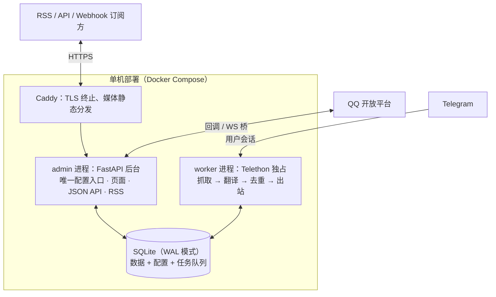

# tgmon

[](https://github.com/znjhahaha/tgmon/actions/workflows/docker.yml)
[](LICENSE)
[](https://github.com/znjhahaha/tgmon/pkgs/container/tgmon)

Telegram 游戏爆料频道监控与分发系统：用户账号抓取 → 游戏识别 → 术语化翻译 → 三层去重，经 RSS、HTTP API、Webhook 与 QQ 机器人对外输出。

系统面向单机、低带宽跨境链路场景设计：全部计算密集型工作（抓取、媒体处理、翻译、向量化）在一台海外 VPS 上完成，对外只输出轻量文本与缩略图。当前用于监控原神、崩坏：星穹铁道、绝区零相关爆料频道。

## 功能特性

**监控与翻译**

- 基于用户账号（Telethon）监控任意已加入频道，含私密频道；后台可从账号一键同步频道列表，无需手动收集频道 ID 或邀请链接
- 游戏识别按关键词证据归类，别名统一（崩铁 / 星铁 / HSR 均归入崩坏：星穹铁道）；网站、RSS、API 与 QQ 共用同一查询结果
- 翻译管线：缓存 → 预算闸门 → 术语注入 → 多后端故障转移 → 译后校验；相同原文命中缓存，不重复计费
- 视频一律不落盘：只提取首帧缩略图并保留 Telegram 原链接

**知识库与检索**

- `/kb` 知识中心含五个页签：资料与术语、来源同步、检索与索引、对话记忆、诊断
- 首次启动自动登记原神、崩坏：星穹铁道、绝区零三个 Fandom MediaWiki API 来源，按角色 / NPC / 派系 / 设定分类同步
- Wiki 新页面与 revision 变更默认进入待审核队列，审核通过后才进入翻译术语表；无有效中文名的候选被驳回并保留，可随时复查
- 本地向量检索：内置 `BAAI/bge-small-zh-v1.5`（512 维，CPU 推理，无需外部 API 与密钥），与 SQLite FTS5 全文索引混合排序；模型缺失时自动回退关键词检索
- 本地修正过的中文名在后续 Wiki 同步中保留，不会被源数据覆盖

**QQ 机器人**

- 两种事件入口：QQ 开放平台 Webhook 回调，或独立 botpy 客户端走 WebSocket 桥
- 19 个群内命令（见下文命令表），非命令文本走 AI 意图路由
- 主动推送按游戏聚合：60 秒窗口内同一游戏的消息合批发送（每批最多 5 条），失败按指数退避重试，送达状态持久化
- 同条爆料的多张图片按原顺序合并为一张 JPEG 长图直传 QQ：等比缩放、不裁切，上限 16000 像素高，正文随媒体消息发出；直传失败回退 URL 中转
- 对话记忆按群话题、群成员、私聊三级隔离，支持滚动摘要、主动记忆（`/remember`）与遗忘

**输出与分享**

- RSS（可切纯文本版）、带 API Key 鉴权的 HTTP API、HMAC-SHA256 签名的 Webhook
- 分享卡片：筛选结果生成两遍布局长图，含完整正文与媒体、消息边界分页、JPEG / ZIP 下载、公开 token 访问

**运行时与运维**

- 双进程单机 Docker Compose 部署，Caddy 终止 TLS 并静态分发媒体
- 除少量启动参数外，全部配置在 Web 后台修改、即时生效
- 发布脚本先在数据库副本上验证，再备份切换；换机 = `git clone` + 拷贝数据目录
- 22 个测试文件、263 个测试函数的回归套件

## 架构

### 双进程模型



```
admin   FastAPI Web 后台（唯一配置入口）。永不接触 Telethon
worker  独占用户会话，执行抓取管线并消费任务队列
```

拆分为两个进程的原因：Telethon 的会话是 SQLite 文件，两个进程同时使用同一会话会互锁并可能损坏授权状态。因此只有 worker 持有 Telegram 连接；admin 需要执行任何涉及 Telegram 的操作（发送验证码、登录、同步频道列表、测试 Provider）时，向 `task` 表写入一条任务，由 worker 执行后回填结果。网页端的 Telegram 登录流程正是通过该队列绕开了 Telethon 的 stdin 交互限制。

两个进程仅通过 SQLite 通信（`app_setting` + `task` 表），WAL 模式并发读写。

### 部署网络的实测约束

架构由部署环境的实测网络特性决定：

| 实测指标 | 设计决策 |
|---|---|
| 拉取国际数据 200 MB/s | 从 Telegram 抓取消息与媒体无瓶颈 |
| 回大陆单连接仅 61 KB/s | 任何「把媒体回传大陆」的设计都会成为瓶颈 → 视频只保留深链与首帧缩略图 |
| OpenAI / Anthropic 官方端点 403 | Provider 的 `base_url` 必填且无默认值，需使用中转端点或 Gemini |
| 磁盘余量小、无 swap | 视频不落盘；缩略图按 LRU + TTL 回收 |
| RTT 233 ms | 服务端渲染 + CSS 内联，无 SPA bundle |

## 快速开始

### 前置要求

- 一台海外 VPS：Docker + Docker Compose v2、git；磁盘需容纳约 1 GB 镜像（含 embedding 权重）及媒体库
- Telegram 账号的 `API_ID` / `API_HASH`（在 [my.telegram.org](https://my.telegram.org) 申请）
- 翻译后端：OpenAI / Anthropic 协议兼容端点（支持自定义 `base_url`）或 Gemini
- 可选：QQ 开放平台（[q.qq.com](https://q.qq.com)）机器人凭据

### 镜像部署（推荐）

镜像由 GitHub Actions 自动构建并发布到 `ghcr.io`，与仓库同为公开，拉取无需登录。每次 push 到 main 更新 `latest`，打 `v*` tag 另发版本号镜像，同时保留 `sha` 快照便于回滚。

```bash
git clone https://github.com/znjhahaha/tgmon.git /opt/tgmon
cd /opt/tgmon && ./deploy.sh
```

使用私有镜像仓库部署时，先 `export GH_PAT=<GitHub PAT，repo + read:packages 权限>` 再执行上述命令。

`deploy.sh` 自动生成 `.env` 与随机后台密码、拉取镜像、启动容器并做健康检查。此后更新版本只需：

```bash
./deploy.sh update    # 拉取代码与镜像，滚动重启
```

### 源码部署（开发调试）

```bash
git clone <仓库地址> /opt/tgmon && cd /opt/tgmon
cp .env.example .env
# 编辑 .env：至少填 TGMON_ADMIN_PASSWORD 和 TGMON_BASE_URL
docker compose up -d --build
```

源码模式将 `./tgmon` 只读挂载进容器：改代码后 `docker compose restart` 即生效，仅修改 `requirements.txt` 时需要重建。生产环境使用 `docker-compose.prod.yml`（纯镜像、不挂代码）。

### 首次配置

打开 `https://<你的地址>`，用 `admin` + 初始密码登录后台，依次完成：

1. **账号与凭据** —— 填入 `API_ID` / `API_HASH` / 手机号 → 点「发送验证码」→ 填入验证码（**验证码发到 Telegram 客户端，不是短信**）→ 如开启了两步验证再填密码
2. **频道管理** —— 点「从我的账号同步」，勾选要监控的频道，无需手动抄 ID；可点「补最近 20 条历史」立即验证管线，不必等新消息
3. **Provider** —— 添加一个部署机可访问的翻译后端，点「连通性测试」
4. **术语表** —— 按游戏维护术语；爆料翻译质量很大程度取决于这张表
5. **输出配置** —— 创建 RSS feed / 生成 API Key / 配置 Webhook

第 1–2 步完成后即可在「消息」页看到数据落库。

## 配置

### 环境变量

以下变量写在 `.env`：应用启动参数、Caddy 反向代理的站点配置与功能默认开关。其余全部配置在网页后台修改：

| 变量 | 必填 | 默认值 | 说明 |
|---|---|---|---|
| `TGMON_SECRET_KEY` | 否 | 自动生成 `secret.key` | 加密 DB 内敏感字段（`api_hash` / `api_key` / HMAC 密钥）的主密钥；换机时必须携带 |
| `TGMON_ADMIN_PASSWORD` | 首次部署 | — | 后台初始密码，建号后可在网页改密并清空此行 |
| `TGMON_BASE_URL` | 是 | — | 对外地址（域名或 IP），RSS 绝对链接与 Webhook 回调使用 |
| `TGMON_LOG_LEVEL` | 否 | `INFO` | 日志级别：`DEBUG` / `INFO` / `WARNING` |
| `TGMON_DOMAIN` | 有域名时 | `localhost` | 对外域名（Caddy 反代站点），与 `TGMON_BASE_URL` 的主机名保持一致 |
| `TGMON_IP` | 否 | `127.0.0.1` | IP 直连回退入口（自签证书），仅需要绕过 DNS 时设置 |
| `TGMON_RETRIEVAL_ENABLED` | 否 | `true` | 消息混合检索开关 |
| `TGMON_EMBEDDING_ENABLED` | 否 | `true` | 本地 embedding 开关 |
| `TGMON_MEMORY_ENABLED` | 否 | `true` | QQ 对话记忆开关 |
| `TGMON_MEMORY_TTL_DAYS` | 否 | `30` | 对话记忆保留天数 |
| `TGMON_WIKI_SYNC_ENABLED` | 否 | `true` | Wiki 知识库同步开关 |
| `TGMON_WIKI_FETCH_INTERVAL_HOURS` | 否 | `24` | Wiki 同步间隔（小时） |

### 优先级与热生效

读取优先级为 **DB → `.env` → 内置默认**；首次启动把 `.env` 作为种子导入数据库。

修改后需要重新登录 Telegram 的只有 `API_ID` / `API_HASH` / `PHONE_NUMBER`（相当于更换应用或账号）。其余配置全部热生效：prompt、术语表、去重阈值、限流、保留策略、频道开关、Provider 配置。

## 输出接口

| 方法 | 路径 | 说明 |
|---|---|---|
| GET | `/rss/{slug}` | RSS 订阅；`?media=none` 为纯文本版 |
| GET | `/feeds` | 全部 feed 地址清单 |
| GET | `/api/messages` | 分页消息，支持按频道 / 时间 / 关键词 / 重复状态过滤 |
| GET | `/api/messages/{id}` | 单条消息详情 |
| GET | `/api/messages/{id}/related` | 相关消息 |
| GET | `/api/search` | 关键词检索 |
| GET | `/api/channels` | 频道列表与统计 |
| GET | `/api/stats` | 总量与 worker 状态 |
| POST | `/api/webhook/test` | 手动触发一次 Webhook 推送 |

- HTTP API 鉴权：`X-API-Key` 请求头，带速率限制
- Webhook 载荷签名：`X-Tgmon-Signature: sha256=<hex>`（HMAC-SHA256），投递失败按退避重试
- 私有 feed 同样要求 `X-API-Key`

## QQ 机器人

### 接入

1. 在 [q.qq.com](https://q.qq.com) 创建机器人，取得 `AppID` / `AppSecret`
2. 后台「QQ 机器人」页填入凭据并打开总开关；可选限定只推送某些频道（`QQ_CHANNEL_IDS`）、设置每群每日推送上限（默认 950，平台硬限 1000）
3. 事件入口二选一：
   - **Webhook 回调** —— 平台直接回调 `/qqbot/callback`
   - **botpy WebSocket 桥** —— 独立 botpy 客户端连接 `/qqbot/bridge`，凭 `QQ_BRIDGE_TOKEN` 鉴权，适合回调地址不可达的部署

### 命令表

| 命令 | 说明 |
|---|---|
| `/help` | 命令列表 |
| `/latest [n]` | 最新 n 条爆料（默认 3，最大 5，按发布时间排序，带图） |
| `/new` | 本群未读增量（上次拉取之后的新消息） |
| `/search 关键词` | 模糊搜索，返回最近 3 条命中 |
| `/ask 问题` | 基于已收录消息回答，附 `【消息#id】` 证据引用 |
| `/translate [游戏] 文本` | 按已审核术语翻译；也可 `/translate #消息id` 翻译已收录消息 |
| `/tr 文本` | `/translate` 别名 |
| `/related 消息id` | 相关消息 |
| `/timeline 关键词` | 消息时间线 |
| `/game 名称 [n]` | 按游戏过滤最新 |
| `/peek 消息id` | 单条完整内容与全部图片 |
| `/video 消息id` | 发送该消息的归档视频 |
| `/stats` | 今日统计（消息数 / 游戏分布 / 频道数） |
| `/status` | 运行状态（桥在线 / 群数 / 今日推送） |
| `/on` / `/off` | 本群推送开关 |
| `/ai 问题` | 显式 AI 问答 |
| `/remember 事实` / `/forget 关键词` | 写入 / 删除个人记忆 |
| `/nickname 昵称` | 设置机器人的称呼（或直接说「叫我 XX」） |
| 非命令文本 | AI 意图路由（默认开启，可在后台关闭） |

### 推送与限流

- **批次**：主动推送按游戏聚合，60 秒窗口（`QQ_BATCH_WINDOW_SECONDS`）内同一游戏的消息合为一批，每批最多 5 条；`/latest`、`/new`、`/game`、`/peek` 与推送均保留同条爆料的全部图片
- **长图**：群富媒体接口一次只接受一个文件，图组按原顺序合并为一张 JPEG 长图（等比缩放、不裁切，上限 16000 像素高），正文附在同一条媒体消息上
- **上传**：优先通过 QQ `file_data` 直传；失败才回退到已配置的 URL 中转（GitHub 图床 / 本站）
- **重试**：发送失败按 `30s × 4^n` 指数退避（上限 1 小时），送达状态持久化，缺图或失败会明确降级，不会误报为已发送
- **被动回复**：每条 @ 消息最多回复 5 次（平台限制），超限自动截断并提示

### 对话记忆

- 作用域隔离：群话题、群内成员、私聊各自独立
- 滚动上下文默认保留 8 轮（`MEMORY_RECENT_TURNS`），累计 12 轮（`MEMORY_SUMMARY_TRIGGER`）触发滚动摘要压缩
- 记忆默认保留 30 天（`MEMORY_TTL_DAYS`）；成员可用 `/remember` 主动写入事实、`/forget` 删除

## 知识库与检索

### Wiki 同步与审核

- 首次启动登记原神、崩坏：星穹铁道、绝区零三个 Fandom MediaWiki API 来源；通用 MediaWiki 适配器也支持接入其他源
- 同步按角色 / NPC / 派系 / 设定分类，默认每 24 小时一次；revision 变更幂等处理，源页面消失时保留旧数据、连续多次消失才禁用该来源
- 审核流：新页面与变更默认待审，后台 `/kb` 支持按游戏 / 分类 / 状态筛选、勾选批量审核、直接修订中文名；审核通过后进入翻译术语表
- 质量规则：中文名只从 Wiki 语言字段与 infobox 解析，绝不用英文标题充当中文名；无有效中文名的候选驳回并保留；驳回决定在后续同步中保持，仅当出现新的有效译名候选才重新打开审核

### 术语校正

翻译时按检测到的游戏取对应术语作用域，最长匹配优先替换；保护 URL、代码、数字、歧义词与已正确的名称不被误替换；无法解析的词项会汇总报告漏译。

### 混合检索

- 消息入库即写入 SQLite FTS5 索引；本地 embedding（`BAAI/bge-small-zh-v1.5`，512 维，CPU，经 fastembed 运行）与全文检索混合排序
- Docker 构建时下载约 90 MB 权重并打包进镜像，运行时不访问外部 embedding API；非 Docker 安装先执行 `python -m tgmon.embeddings --download`
- 长文分块计算向量；内容修改或模型升级自动重建索引，旧模型向量不会混用
- 检索支持游戏 / 频道 / 时间 / 实体过滤；QQ 侧的 `/search`、`/ask`、`/related`、`/timeline` 与网页后台共用同一检索接口
- 模型不可用时自动回退关键词检索，功能不中断

## 消息去重

| 层级 | 机制 | 说明 |
|---|---|---|
| 1. 消息 ID | `(channel_id, tg_message_id)` 唯一索引 | 零成本，防重启重放 |
| 2. 文本指纹 | 归一化（去 emoji、折叠空白、剥频道尾巴与推广行、统一标点）后 SHA-256；SimHash 抓改动较小的转发 | 成本低 |
| 3. 图像感知哈希 | pHash 与 dHash 取距离较小者 | 纯本地计算，不调 AI |

第 3 层实测边界（后台「去重」页内置对照表）：重新编码、强压缩、半透明水印、不透明色块水印、调亮均可命中（距离 0–2）；**裁剪与加边框无法命中**（距离 11–29），这是感知哈希的固有限制，由第 2 层兜底。

命中重复不丢弃，仅标记 `duplicate_of` 指向首条；后台可展开查看「这条在哪些频道出现过」，并支持人工翻案。

## 分享卡片

- 在「分享」页按条件筛选消息（最多 50 条），生成两遍布局的长图卡片：完整正文与媒体、按消息边界分页
- 支持 JPEG 与 ZIP 打包下载、跨分页多选、完整文案复制
- 每个分享生成公开 token，读者无需登录即可通过链接查看长图与媒体

## 运维

### 更新

```bash
./deploy.sh update
```

拉取最新代码与镜像并滚动重启。

### 发布流程

生产发布使用两段式脚本：

1. `scripts/stage_release.sh` —— 先在数据库副本上运行新版本验证
2. `scripts/apply_release.sh` —— 自动备份数据库后切换服务

### 备份与迁移

代码在 git 里，换机时 `git clone` + 启动即可恢复服务；以下数据**不在 git 里**，需单独迁移：

| 内容 | 丢失后果 |
|---|---|
| `.env` + `secret.key` | DB 内已存的 `api_hash` / `api_key` 解不开，需重新配置并重新登录 |
| `sessions/` | Telegram 登录态丢失，需重新验证码登录 |
| `db/` | 全部消息、配置与知识库数据 |
| `media/` | 缩略图与归档媒体 |

后台「系统」页可下载配置备份（配置 + 术语表 + prompt + feed 定义）；`scripts/backup.sh` 与 `scripts/backup_database.py` 用于数据库备份。

### 健康检查

`GET /healthz` 返回服务存活状态，`deploy.sh` 的启动检查依赖它。

### 账号风险

使用用户账号自动化读取违反 Telegram 服务条款，加入大量爆料频道更容易触发风控。**强烈建议使用专用小号，不要用主账号**；`sessions/` 要备份；控制加入频道的节奏。这是本方案最大的不可逆风险。

## 开发

### 本地环境

```bash
cp .env.example .env       # 填 TGMON_ADMIN_PASSWORD / TGMON_BASE_URL
docker compose up -d --build
```

源码模式将 `./tgmon` 只读挂载进容器：改代码后 `docker compose restart` 生效，改 `requirements.txt` 后需 `--build` 重建。

### 测试与检查

```bash
python -m pytest -q            # 22 个测试文件、263 个测试函数
python -m compileall -q tgmon  # 语法检查
```

### 技术栈

| 层 | 选型 |
|---|---|
| 抓取 | Telethon（用户账号）+ cryptg |
| Web | FastAPI + Jinja2 + htmx（服务端渲染，无前端构建） |
| 存储 | SQLite（WAL + FTS5），SQLAlchemy 2 |
| AI | openai / anthropic 协议客户端，多 Provider 故障转移 |
| 检索 | fastembed + `BAAI/bge-small-zh-v1.5`（本地 CPU 推理） |
| 媒体 | Pillow + numpy（自实现 DCT 感知哈希，不依赖 scipy） |
| 输出 | feedgen（RSS）、HMAC 签名 Webhook |
| Wiki | mwparserfromhell（MediaWiki 解析） |
| 部署 | Docker Compose + Caddy + GitHub Actions → ghcr.io |

### 目录结构

```
tgmon/
├── admin/                  FastAPI Web 后台：路由模块、页面模板、JSON API、RSS
├── worker/                 Telethon 生命周期、任务队列消费、定时维护
├── qqbot/                  QQ 机器人：命令、Agent 对话、批次推送、媒体发送
├── kb/                     知识库：Wiki 同步、审核、术语导入、诊断
├── providers/              AI 后端协议注册表与故障转移链
├── pipeline.py             抓取管线
├── translate.py            翻译管线：缓存 → 预算 → 术语注入 → 故障转移 → 译后校验
├── glossary.py             术语注入与漏译检测
├── classify.py             游戏识别与证据化分类
├── message_query.py        统一消息查询（网站 / RSS / API / QQ 共用）
├── dedup.py                文本归一化 + SHA-256 + SimHash
├── imghash.py              pHash / dHash（自实现 DCT）
├── media.py                缩略图提取（视频不落盘）
├── embeddings.py           本地 embedding 下载与运行
├── retrieval.py            FTS5 + 向量混合检索
├── memory.py               QQ 对话记忆（隔离 / 滚动摘要）
├── member_profile.py       群成员画像
├── card.py                 分享长图卡片
├── sharing.py              分享快照与公开 token
├── outputs.py              Webhook 推送与统一序列化
├── prompts.py              三层 prompt 解析
├── unified_jobs.py         统一任务调度
├── unified_migration.py    幂等数据迁移
└── db.py settings.py crypto.py models.py paths.py util.py lang.py    基础设施
```

## 许可证

[MIT](LICENSE)。欢迎通过 [Issue](https://github.com/znjhahaha/tgmon/issues) 与 Pull Request 反馈问题与改进。

内置第三方资源遵循各自上游许可证：[htmx](https://htmx.org)（Zero-Clause BSD）、[Noto Sans SC](https://fonts.google.com/noto/specimen/Noto+Sans+SC) 字体（SIL Open Font License 1.1）。

